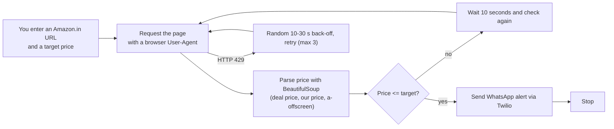

# 🛍️ Amazon Price Tracker Bot

**My first self-built Python project (2024):** a script that watches an Amazon.in product page and sends a WhatsApp message when the price drops to your target.


---

## 🧭 How it works



- Only `amazon.in` URLs are accepted; prices are read in rupees (₹).
- The price is located by trying the deal-price element, the regular-price element, then the generic `a-offscreen` price class.
- Rate limiting (HTTP 429) is handled with a random 10 to 30 second back-off and up to 3 retries.
- Successes and errors can be logged to `price_tracker.log`.

---

## 🚀 Run it

```bash
git clone https://github.com/Sajal-10903/AmazonPriceTrackerBot.git
cd AmazonPriceTrackerBot
pip install requests beautifulsoup4 twilio
```

Set your Twilio credentials as environment variables (never hard-code them):

| Variable | Meaning |
|---|---|
| `TWILIO_ACCOUNT_SID` | Twilio account SID |
| `TWILIO_AUTH_TOKEN` | Twilio auth token |
| `TWILIO_PHONE_NUMBER` | Your Twilio WhatsApp-enabled number |
| `YOUR_PHONE_NUMBER` | The number that receives the alert |

```bash
python apt.py
# Enter Amazon.in product URL: https://www.amazon.in/...
# Enter desired price: ₹1999
```

---

## ⚠️ Limitations

- **Scraping is fragile.** Amazon changes its page layout and blocks automated requests, so price detection can break or return a CAPTCHA page. Amazon's terms also restrict automated scraping; use this for learning and personal use only.
- Tracks one product at a time and checks every 10 seconds, which is aggressive and likely to get blocked. A longer interval is recommended.
- Requires a Twilio account (WhatsApp sandbox works for testing).

## 💡 What I learned / would improve

This project taught me HTTP requests, HTML parsing, environment-based secrets, retries and logging. If I rebuilt it today I would use a maintained price API or a headless browser, support multiple products from a config file, store price history, and add email/Telegram notifications.

---

**Author:** [Sajal Raj](https://github.com/Sajal-10903) · [Portfolio](https://sajalraj-portfolio.vercel.app) · [LinkedIn](https://www.linkedin.com/in/sajal-raj-456b31252/)
